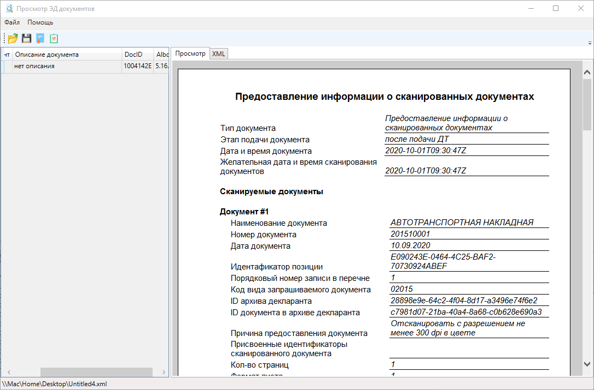
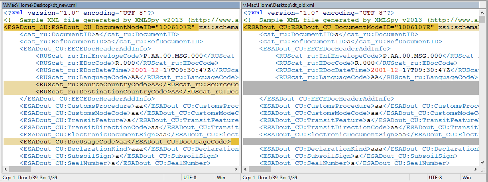
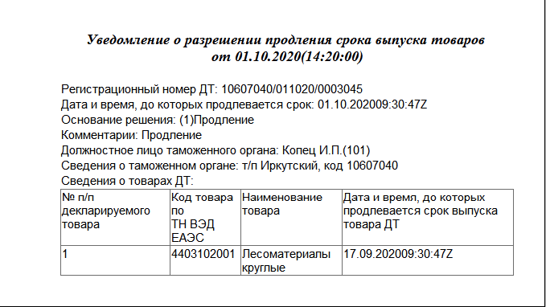
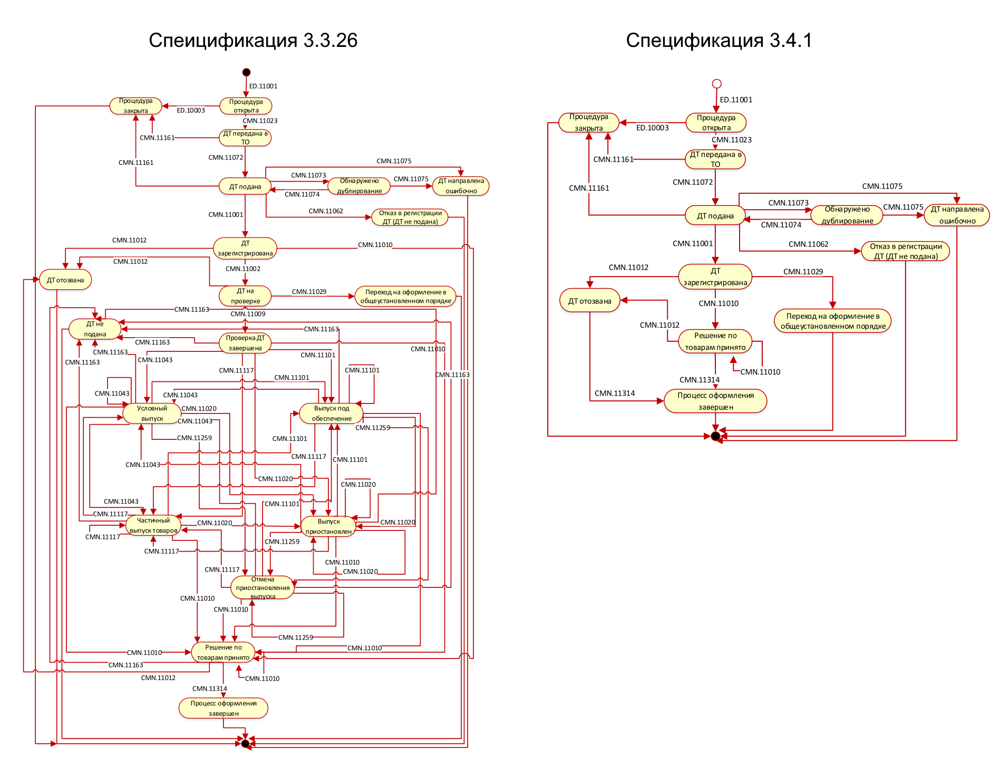
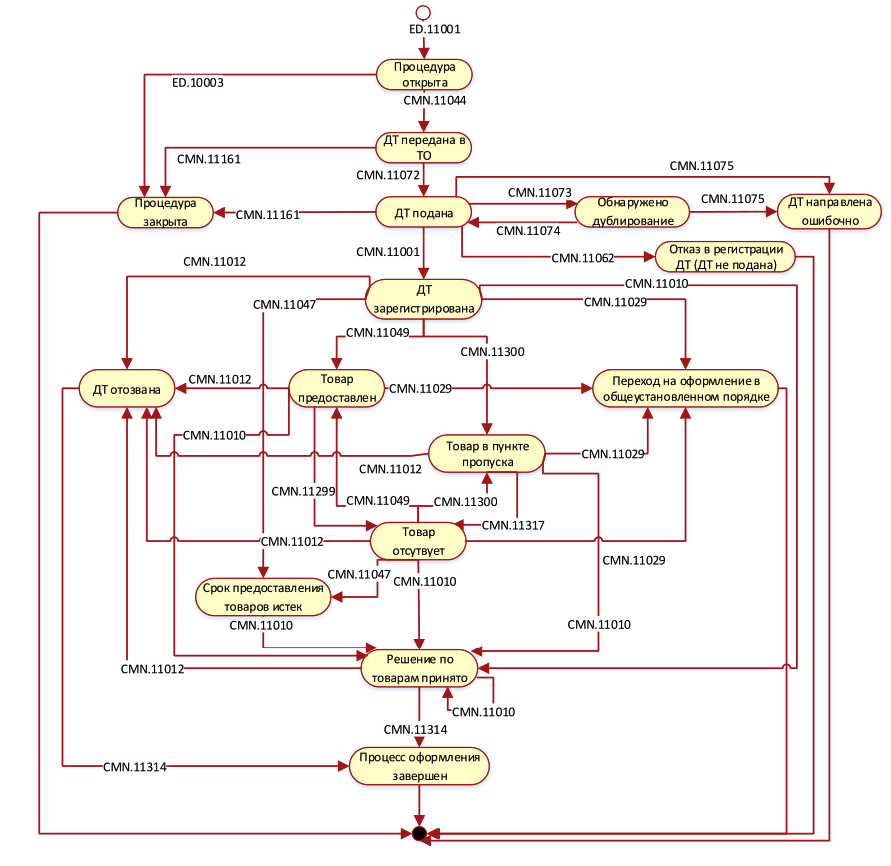
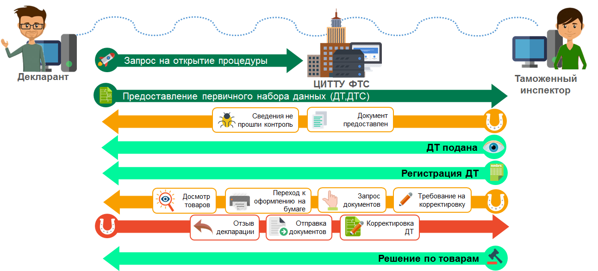

# Изменения в электронном декларировании с 1 октября 2020 года

### План
 - Введение
 - Альбом форматов
 - Спецификация обмена
 - Изменения в программе ВЭД-Декларант
 - Заключение
 - Список использованных источников

### Введение
С начала введения обязательного электронного декларирования через сеть Интернет прошло пять лет. За это время технология электронного декларирования претерпела серьезные изменения: появился контроль однократности предоставления, расширился перечень поддерживаемых таможенных процедур, упразднился состав контейнера таможенной декларации, альбом форматов пополнился новыми структурами и т.д. Происходящие с электронным декларированием изменения связаны с вступлением в силу новых нормативно-правовых актов,учетом предложений заинтересованных лиц и исправлением неточностей. В течении одного года как-правило происходит 3-4 изменения в электронном декларировании. Эти изменения связаны с технической документацией, которую именуют альбом форматов и спецификацией обмена. Первый  содержит перечень допустимых в электронном декларировании структур информации. Второй содержит порядок  информационного обмена, перечень ошибок и возможные статусы процесса таможенного оформления. Оба этих источника изменений публикуются на сайте ФТС под определенным порядковым номером. Например, действующий альбом форматов опубликован под номером 5.15.0, а спецификация обмена 3.3.26.  Отметим, что на момент введения обязательного электронного декларирования альбом форматов был помечен номером 5.0.14, а спецификация обмена 3.2.0. В статье будут рассмотрены разрабатываемые альбом форматов 5.16.0 и спецификация обмена 3.4.1, которые вступят в силу с 1 октября 2020 года.  

### Альбом форматов
Альбом форматов электронных форм документов состоит из 14 глав. Каждая из глав представляет из себя таблицу с описание структуры электронных документов. Например, в самой объемной по содержанию главе 6.6 "Таможенные ЭД" представлено описание структуры декларации на товары, декларации таможенной стоимости и других документов. На основе альбома форматов разработчики программного обеспечения создают программы для взаимодействия с таможенными органами. Также этот документ часто служит для разрешения разногласий между пожеланиями/требованиями должностных лиц по представлению сведений и возможностью по предоставлению нужных данных из программных средств участников ВЭД.

Всего альбом форматов версии 5.16.0 насчитывает 579 электронных документов. По сравнению с версией 5.15.0 в новую версию было добавлено 12 документов:
- **AditionalInformation** - Дополнительная информация к заявлению на ЕПГУ
- **ConfirmationOfSubsoilUserOrg** - Электронное подтверждение организации - пользователя недр;
- **DebtReceiveConfirmation** - Подтверждение ознакомления с поручением/решением/требованием/уведомлением таможенного органа при получении информации о задолженности участника ВЭД;
- **ExportCommercialAct** - Коммерческий акт РЖД;
- **GuarantCertificate** - Сертификат обеспечения исполнения обязанности по уплате таможенных пошлин, налогов;
- **IntellectualProperty** - Заявление на оказание услуги "Ведение реестра объектов интеллектуальной собственности" / Заявление о включени ОИС в тпможенный реестр ОИС / Заявление о продлении срока включения ОИС в таможенный реестр ОИС / Заявление об исключении ОИС из таможенного реестра ОИС / Обращение об изменении сведений, указанных в заявлении о включении ОИС в таможенный реестр ОИС либо прилагаемых к нему документах;
- **IntellectualPropertyDecision** - Уведомление о проведении проверки информации, содержащейся в обращении об изменении сведений, указанных в заявлении о включении ОИС в реестр, либо прилагаемых к нему документах / Уведомление о вынесенном решении о включении объекта интеллектуальной собственности в таможенный реестр объектов интеллектуальной собственности / Уведомление о вынесенном предварительном решении о включении объекта интеллектуальной собственности в таможенный реестр объектов интеллектуальной собственности / Уведомление о вынесенном решении о продлении срока включения объекта интеллектуальной собственности в таможенный реестр объектов интеллектуальной собственности / Уведомление о вынесенном решении о внесении изменений в таможенный реестр объектов интеллектуальной собственности / Уведомление о вынесенном решении об отказе во внесении изменений в таможенный реестр объектов интеллектуальной собственности / Уведомление о вынесенном решении об отказе во включении объекта интеллектуальной собственности в таможенный реестр объектов интеллектуальной собственности / Уведомление о вынесенном решении об исключении объекта интеллектуальной собственности из таможенного реестра объектов интеллектуальной собственности;
- **NoPersonalUse** - Решение о неотнесении товаров к товарам для личного пользования;
- **NotificationTRP** - Уведомления о ходе рассмотрения заявления на ЕПГУ;
- **QueueScan** - Уведомление о назначении времени сканирования;
- **ScanDoc** - Запрос на сканирование документов / Предоставление информации о сканированных документах;
- **TPO_Debt** - Таможенный приходный ордер (для расчета задолженности).

В данной статье мы рассмотрим только один из представленных в этом списке документов "Запрос на сканирование документов / Предоставление информации о сканированных документах". Ниже представлен визуальный вид данного документа:

Представленный документы как и "Уведомление о назначении времени сканирования" будет использован при запросе оригиналов документов через отдельный подпроцесс декларирования. Кроме представленных на скриншоте полей  документ также включает сведения о декларанте и сведения о таможенном органе сканирования.

Новый альбом форматов также несет в себе изменения и для старых документов. Часть из них приурочено к вступлению в силу Решений Коллегии Евразийской экономической комиссии от 21.04.2020 № 54,  53 и 52. Решения  посвящены внесению изменений в структуру и формат декларации на товары, транзитной декларации,  корректировки декларации на товары и декларации таможенной стоимости. Ниже рассмотрим этим изменения подробнее.

В ДТ, ТД и КДТ изменения касаются добавлением новых полей:

- SourceCountryCode - Код страны-отправителя сообщения. Поле не является обязательны, заполняется из классификатора стран мира.
- DestinationCountryCode - Код страны-получателя сообщения. Поле не является обязательны, заполняется из классификатора стран мира.
- DocUsageCode - Код использования транспортных (перевозочных), коммерческих и (или) иных документов в качестве таможенной декларации.  Поле не является обязательным для заполнения.
- InvoicedCurrencyDate - Дата применения курса валюты.  Поле не является обязательным для заполнения. Отметим, что подобное поле в старых версиях форматов было, но затем его упразднили. 
- ManufacturerINN - ИНН производителя (изготовителя) товар. Поле относится группам товаров в графе 31 и не является обязательным для заполнения.
- ManufacturerOKATO - Код ОКАТО производителя (изготовителя) товар. Поле относится группам товаров в графе 31 и не является обязательным для заполнения.
- PIDocumentNumber - Регистрационный номер предварительной информации. Данное поле относится к графе 40 ДТ. В составе этой графе появилась структура данных для указания регистрационного номера предварительной информации. 
- DestinationCountryDetails - Сведения о стране назначения при временном периодическом декларировании. Поле (структура полей) не является обязательным для заполнения, но позволяет указывать несколько значений.

В ДТС два новых поля:
- SourceCountryCode - Код страны-отправителя сообщения. Поле не является обязательны, заполняется из классификатора стран мира.
- DestinationCountryCode - Код страны-получателя сообщения. Поле не является обязательны, заполняется из классификатора стран мира.

Это не все изменения в электронных документах. С перечнем всех изменения можно ознакомиться в документе [лист изменений](http://customs.gov.ru/storage/folder_page/2019/12-26/eUtl3rcH/5.16.0%20%D0%9B%D0%B8%D1%81%D1%82%20%D0%B8%D0%B7%D0%BC%D0%B5%D0%BD%D0%B5%D0%BD%D0%B8%D0%B9_%D0%B2%D0%BD%D0%B5%D1%88%D0%BD%D0%B8%D0%B9_2.pdf).

## Спецификация обмена
Спецификация обмена более сложный документ по сравнению с альбом форматов. Спецификация состоит из основного документа и 25 приложений. Основной документ содержит базовые определения, описание структуры электронных сообщений, перечень сообщений и их состав. Каждое из приложений спецификации (за исключением приложения А и А1) представляет собой порядок информационного обмена между заинтересованными лицами и таможенными органами. Изменения в спецификации обмена 3.3.36 затрагивают  основной документ, так и все его приложения. 

В данной статье мы рассмотрим изменения в спецификации, которые напрямую связаны с декларированием товаров. 
1. Для приложения спецификации В1 расширен перечень поддерживаемых таможенных процедур. К таким процедурам относятся:
- ИМ 90 Специальная таможенная процедура
- ЭК 90 Специальная таможенная процедура
- ИМ 93 Уничтожение
- ИМ 94 Отказ в пользу государства
При этом для таможенной процедуры ИМ 93 добавилась возможность отправлять в таможенный орган по факту уничтожения товаров акт, подтверждающий уничтожение товаров.
Отдельно оговорено, что в рамках удаленного выпуска не допускается оформление таможенных процедур ИМ 93 и ИМ 94.
Приведенные таможенные процедуры ранее были описаны в приложении В17 спецификации обмена. В версии 3.4.1 данное приложение было удалено.

2. В состав сообщений CMN.11010 "Решение по товарам ДТ ИМ (контейнер)" и CMN.11033 "Решение по товарам ДТ. ЭК (контейнер)" был добавлен документ ProlongationNotif "Уведомление о разрешении/запрете продления срока выпуска товаров / Решение о продлении/отказе в продлении срока приостановления выпуска товаров / Уведомление о продлении сроков выдачи МПО".

3. По статусным моделям при декларировании ввозимых и вывозимых товаров исключены статусы: «ДТ на проверке», «ДТ не подана», «Проверка ДТ завершена», «Условный выпуск», «Выпуск под обеспечение», «Частичный выпуск товаров», «Выпуск приостановлен», «Отмена приостановления выпуска». В результате этих нововведений декларация после подачи будет зарегистрирована, а потом выпущена. Отметим, подобный набор статусов близок к статусной модели подачи транзитной декларации. Для демонстрации этих изменений приведем сравнение статусных моделей спецификация 3.3.26 и 3.4.1 при декларировании вывозимых товаров:  

Не смотря на кажущиеся упрощения процесс декларирования изменится не сильно. Частичный выпуск, выпуск под обеспечение и условный выпуск будут отражаться в отметках  решения по ДТ. Статус "ДТ на проверке" являлся избыточным, особенно в условиях автоматического принятия решений по ДТ. 

Аналогичные упрощения произошли и со статусной моделью при подаче предварительной таможенной декларации. Нужно отметить, что отправка уведомления о прибытии товарной партии будет возможно в статусе "ДТ зарегистрирована". Также в этой статусной модели  при получении уведомления о прибытии и выявления факта отсутствия товара Авторизованная система таможенных органов направляет уведомление о фактическом отсутствии товаров , сообщение CMN.11299. Процесс оформления переходит в новое состояние состояние «Товар отсутствует».

Отметим, что в спецификации обмена 3.3.26 в статус "ДТ на проверке" декларация на товары переходило после получения сообщения CMN.11002 "Регистрационный номер, дата и время начала проверки". В спецификации 3.4.1 данное сообщение по прежнему будет приходить участнику ВЭД, однако статус обмена меняться не будет (как был статус "ДТ зарегистрирована", так он и останется).

4. Подача заявления о выпуске товаров до подачи ДТ (для уполномоченных экономических операторов). Из статусной модели был удален статус "Заявление на проверке". После подачи заявление обмен переходит в статус "Заявление зарегистрировано". В этом статусе заявление находится до своего выпуска. Окончание обмена по заявлению обозначено новым статусом "Процесс завершен". Кроме этого был уточнен порядок форматно-логичного контроля заявления перед регистрацией. 

5. Ответ на запрос оригинала документов выведен в отдельный подпроцесс. При совершении таможенных операций в процессе декларирования товаров с применением сведений, подаваемых в электронном виде, должностное лицо таможенного органа имеет возможность запросить у декларанта предоставление оригинала документа. При этом запрос на предоставление оригинала документа может быть направлен в любом статусе процедуры декларирования, как до регистрации, так и после выпуска. Как и в предыдущих спецификациях таможенный орган направляет декларанту запрос на сканирование, а декларант может ответить на него одним из следующих вариантов:
- предоставить идентификационный номер отсканированного документа, размещенного в электронном архиве декларанта;
- направить запрос на сканирование документа, указав код таможенного органа, в который будет предоставлен оригинал документа;
- проинформировать таможенный орган о предоставлении оригинала документа очно в ТО оформления.

При этом для второго варианта разработана статусная модель с открытием новой процедуры декларирования:

В случае если запрос был получен в ТО вне графика работы таможенного органа, то из информационной системы таможенных органов  декларанту направляется уведомление о невозможности исполнения запрошенных действий.

В случае поступления запроса в таможенный орган в соответствии с графиком работы, то запрос автоматически регистрируется, и информация об этом направляется из декларанту.

После регистрации уполномоченное лицо принимает решение о возможности проведения процесса сканирования в таможенном органе. В случае если в таможенном органе нет технической возможности или на заявленную дату на сканирование отсутствует свободное время, из то декларанту направляет уведомление о невозможности исполнения запрошенных действий.

В случае если в установленный срок документы не предоставлены на сканирование, то декларанту направляется уведомление о невозможности исполнения запрошенных действий.

При фактическом поступлении документов на сканирование уполномоченное должностное лицо проводит проверку на возможность сканирования каждого документа. Для каждого документа, допущенного к сканированию, проводиться сканирование и заполняется лист проверки. По завершению обработки всех представленных документов декларанту направляется уведомление о завершении процесса сканирования.

Как было отмечено выше запрос оригинала документов может быть направлен и после выпуска декларации. Статусная модель обмена при этом имеет вид:

Отметим, что декларант может отказаться от предоставления оригинала документов путем предоставления документа "Отказ в предоставлении запрошенных сведений".

Это не все изменения в спецификации обмена. Перечень всех изменения можно найти в файле лист изменений [лист изменений](http://customs.gov.ru/storage/folder_page/2019/12-26/eUtl3rcH/%D0%A1%D0%BF%D0%B5%D1%86%D0%B8%D1%84%D0%B8%D0%BA%D0%B0%D1%86%D0%B8%D1%8F%20%D0%BE%D0%B1%D0%BC%D0%B5%D0%BD%D0%B0%20_%D0%B2%D0%BD%D0%B5%D1%88%D0%BD.%203.4.1.%20%D0%9B%D0%B8%D1%81%D1%82%20%D0%B8%D0%B7%D0%BC%D0%B5%D0%BD%D0%B5%D0%BD%D0%B8%D0%B9.pdf).

### Изменения в программе ВЭД-Декларант
Версия программы ВЭД-Декларант и Монитор ЭД с поддержкой новых форматов традиционно выходит за неделю до вступления нового формата обмена. В этот раз версия будет скорее всего будет доступна для скачивания начиная с 28 сентября 2020 года. Ниже будет представлен обзор изменений, который появится в версии ВЭД-Декларант 9.94 и Монитор ЭД 4.10.

### Заключение
Выход новых версий форматов обмена для участников ВЭД зачастую является стрессом: нужно обновить свое программное средство, изучить нормативно-правовые акты и привыкнуть к новым особенностям информационного обмена. Не все декларанты это делают вовремя. Остается не малое количество декларантов которые не знают о смене форматов или отказываются проводить обновление программы для декларирования. Такой подход позволял декларантам достаточно долго работать на устаревшем программном обеспечении и применять старые форматы обмена. С 01.08.2020 таможенные органы стали ограничивать время работы старых форматов обмена двумя неделями с момента вступления в силу новых форматов. Это означает, что до 13.10.2020 года у декларантов есть время произвести обновление своего программного обеспечение и переключиться на формат обмена 5.16.0/3.4.1. Мы считаем, что обновляться на новый формат нужно заблаговременно несмотря на те сложности, которые это обновление может принести в первые дни вступления нового формата.

### Список использованных источников
1. Спецификация интерфейса взаимодействия между информационными системами таможенных органов и информационными системами, предназначенными для представления участниками внешнеэкономической деятельности сведений таможенным органам в электронной форме 3.4.1. URL:  customs.gov.ru (дата обращения 15.09.2020).
2. Альбом форматов электронных форм документов, предназначенных для организации взаимодействия между информационными системами таможенных органов и информационными системами, предназначенными для представления участниками внешнеэкономической деятельности сведений таможенным органам в электронной форме 5.16.0 URL:  customs.gov.ru/ (дата обращения 15.09.2020).
3. Решение Коллегии Евразийской экономической комиссии от 21.04.2020 № 54 "О внесении изменений в структуру и формат декларации на товары и транзитной декларации". URL: www.eurasiancommission.org (дата обращения 15.09.2020).
4. Решение Коллегии Евразийской экономической комиссии от 21.04.2020 № 53 "О внесении изменений в структуру и формат корректировки декларации на товары". URL: www.eurasiancommission.org (дата обращения 15.09.2020).
5. Решение Коллегии Евразийской экономической комиссии от 21.04.2020 № 52 "О внесении изменений в структуру и формат декларации таможенной стоимости". URL: www.eurasiancommission.org (дата обращения 15.09.2020).
