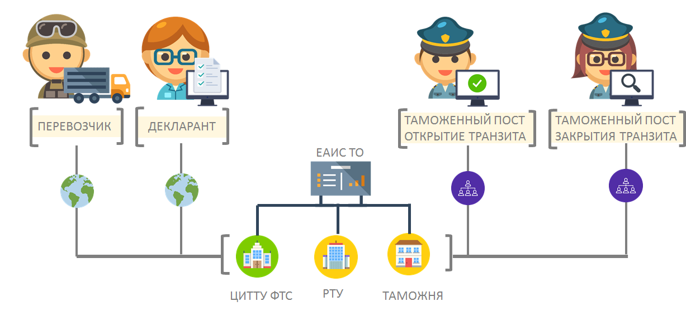

# Автоматическая регистрация транзитных деклараций в 2020 году

План
- Введение
- Об электронном транзите
- Нормативно-правовые документы
- Критерии авторегистрации
- Схема авторегиатрации 
- Выводы
- Список использованных источников

## Введение

Современная форма взаимодействия декларантов с таможенными органами протекает через различные узлы ассоциации сетей Интернет. При этом скорость передачи данных настолько велика, что декларация с комплектом документов доставляются в таможенные органы в режиме близким к онлайн. 
С увеличением участников информационного обмена и реорганизацией таможенных постов должностные лица таможенных органов испытывают определенные сложности при принятии тех или иных решений в отведенные по законодательству сроки. При этом большая часть деклараций с точки зрения характеристик товаров и способа определения таможенной стоимости являются единообразными. Проверка, регистрация и выпуск подобных деклараций не требует особых эвристических методов и может быть четко формализован и алгоритмизирован. Полученный алгоритм может выполняться без участия человека, освобождая его время для более сложных операций с документами.

Разработка алгоритма проверки, регистрации и выпуска деклараций происходит непрерывно. На основе разработанного алгоритма таможенным органам РФ удалость реализовать и применить две технологии:
    • автоматическая регистрация (АР) декларации на товары;
    • автоматический выпуск (АВ) декларации на товары.

Переход от автоматизированных информационных систем к автоматическим является показателем развития отрасли в современном мире. Яркими примерами таких переходов являются беспилотные транспортные средства, голосовые помощники, магазины без продавцов и т.д. Таможенные органы не отстают от современных тенденций развития информационных технологией и тоже применяют различные системы для выполнения операций без участия человека.  

Появление данной технологии во многом связано с решением задачи по ускорению проведения таможенных операций. Хотя задача ускорения решалась в таможенных органах всегда, использование при этом автоматизированных систем принятия решений появилась относительно недавно. Связано это в первую очередь с появлением и развитием электронного декларирования и электронного представления сведений в таможенные органы.

При этом важным показателем, который заставляет развивать подобные технологии и системы является время. Например, среднее время необходимое для приема и выпуска таможенной декларации при участии должностных лиц таможенного органа может составлять несколько часов. С помощью автоматических систем можно сократить время на принятие решений и проводить необходимые операции за минуты. В данной статье будет рассмотрена современная практика принятия решений о регистрации транзитных деклараций. 

